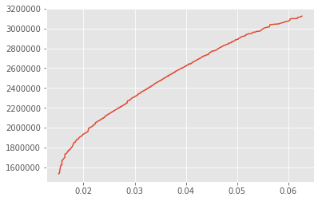

# Optimization Methods In Finance

## MeanVarianceModel.ipynb	
- This notebook calculates rate of returns of 12 indian stocks and presents classical **Markovitz Mean-Variance Model** on them. We have also plotted optimal frontier of the model by showing tradeoff between rate of returns and risk. 
- We depict **Two Fund Theorem** that 'Any two optimal porftolio generates the optimal frontiers'. We then use this theorem to generate the same optimal frontier.
- We then show the **Capital Asset Pricing Model** and the **Market Capital Line** for the set of stocks.

## PortfolioDiagram.ipynb
- This shows effect of correlation between stock on the optimal frontier. The current model takes two stocks and shows the impact of the correlation parameter.

## FuzzyPortfolioOptimization.ipynb

In probabilistic portfolio models, the basic assumption is that the future of risky assets can be correctly reflected by its historical data. This is generally not true, thus this model goes against that to present a possibilitic portfolio model based on fuzzy theory. 

- Real Life Constraints
  - Investors Aspiration Level and Decision Control Variables [ Multi Objective to Single Objective Fuzzy Formulation ]
  - Fuzzy Rate of Returns and Risk Measure
  - Multiple time period investment
  - Diversification in investment [ Entropy and Cardianlity Constraint ]
  - Minimum Transaction Lots 
- Formulation 
  - Bi-objective Model (Max. Terminal Wealth and Min. Risk)
  - Investment Return – Possibilistic Mean value of the return rate
  - Investment Risk – Lower Possibilistic Semivariance of the return rate
  - Diversification Degree – Proportion Entropy and Max-K Stock
  - Investors Satisfaction Degree – S shaped Membership Function (for each objective)

We used **genetic algorithms** to solve the resulted **multi-objective non-linear integer programming problem**. We generated optimum frontier using **NSGA-II** and used vanilla genetic algorithm to solve derived single objective folmulations.

## Appendix [Dataset]
We extracted data from `pandas_datareader` for following stocks:
- SBIN.NS
- HDFCBANK.NS
- ASIANPAINT.NS
- ACC.NS
- HCLTECH.NS
- YESBANK.NS
- KOTAKBANK.NS
- WIPRO.BO
- MARUTI.BO
- ITC.BO
- COALINDIA.BO
- BHARTIARTL.BO

## References 
[1] A multi-period fuzzy portfolio optimization model with minimum transaction lots, Yong-Jun Liu, Wei-Guo Zhang

